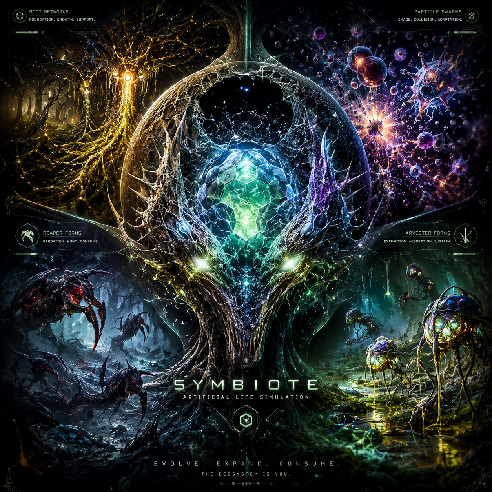

]0;echo "# Symbiote"# Symbiote
]0;echo
]0;echo '
'

]0;echo '  '  
]0;echo '
'

]0;echo
]0;tail -n +4 README.md
 

Rust Powered Terminal Artificial Life SIM

Symbiote is a persistent artificial life ecosystem written entirely in Rust.

It is a real-time terminal-rendered biosphere focused on:

- emergence
- territorial memory
- adaptive ecology
- lineage evolution
- morphology-aware behavior
- long-run ecosystem persistence
- migration topology
- ecological reinforcement
- ecosystem readability
- procedural infrastructure growth
- Conway-inspired substrate behavior
- axiom-driven evolutionary pressure
- open-ended artificial life experimentation

This is not a traditional game.

Symbiote is designed as a living procedural ecosystem where:

- organisms evolve
- ecological pressure accumulates
- migration lanes emerge
- territory stabilizes
- infrastructure persists
- species rise and collapse
- roots become geography
- archetypes form ecological roles
- lineages become persistent history
- the world develops memory over time

The goal is not scripted gameplay.

The goal is believable artificial existence.

---------------------------------------------------------------------------------

## Current Ecosystem Focus

Symbiote currently emphasizes:

- adaptive ecological behavior
- territorial reinforcement
- long-run ecosystem persistence
- meaningful sparse-space readability
- emergent migration systems
- lineage drift and species turnover
- ecological memory fields
- procedural infrastructure growth
- ecosystem storytelling through behavior
- morphology-aware rendering
- behavioral readability
- adaptive substrate density
- field-responsive motion
- invisible ecology pressure systems
- computational weather-like ecosystem influence
- movement-first rendering philosophy
- archetype inheritance
- primitive-to-evolved life progression
- regional archetype cohesion
- axiom divergence telemetry
- Conway-inspired evolutionary pressure

The ecosystem intentionally begins sparse and evolves naturally through:

- survival
- reproduction
- migration
- ecological pressure
- adaptive reinforcement
- territorial attraction
- ecological avoidance
- lineage adaptation
- archetype specialization
- maturity-based persistence
- axiom-imprinted mutation pressure

Density is earned by the ecosystem itself over time.

-----------------------------------------------------------------------------------

## Core Systems

### PatternField Ecology

The PatternField system acts as persistent ecological memory.

It stores and reinforces:

- danger
- growth
- cohesion
- drift
- stability
- migration traces
- territorial pressure
- ecosystem history
- reinforcement corridors
- ecological affinity pressure

The field actively influences:

- ecosystem behavior
- territorial formation
- migration topology
- ecological balancing
- movement pressure
- long-run world structure

The field is evolving toward:

> an ecosystem nervous system.

Importantly, the field layer is now treated primarily as:

- invisible atmospheric pressure
- ecological memory
- migration influence
- behavioral guidance
- computational weather

rather than a dominant visual overlay.

-------------------------------------------------------------------------------------------------------

### Conway-Style Cellular Ecology

Symbiote includes Conway-inspired propagation systems integrated directly into substrate ecology.

Core automata behavior includes:

- survival with 2–3 neighboring live cells
- underpopulation death
- overpopulation collapse
- birth from exactly 3 neighboring live neighbors
- propagation reinforcement
- ecological fronts
- substrate terraces
- oscillation pockets
- dead-cell wake formation

Additional ecological propagation pressure exists for:

- spores
- nutrients
- dead substrate
- mutagen spread
- nest formation

These systems transformed Symbiote from random particle activity into:

- persistent ecosystem topology
- emergent infrastructure
- migration terrain
- ecological seam formation
- long-run propagation behavior

--------------------------------------------------------------------------------------------------------

### Axiom Lattice

The Axiom Lattice is a Conway-inspired abstract pattern layer used for evolutionary interpretation.

It tracks pattern states such as:

- Dormant
- Static
- Oscillating
- Translating
- Expanding
- Collapsing
- Chaotic

These states provide a foundation for axiom-driven heredity and future open-ended mutation pressure.

The Axiom Lattice does not directly script life.

It acts as an abstract ecological signal that can influence how mature lineages diverge over time.

---------------------------------------------------------------------------------------------------------

### Territorial Reinforcement

The world gradually develops:

- ecological districts
- migration corridors
- root highways
- territorial seams
- persistent settlement regions
- abandoned ecological zones
- infrastructure-like reinforcement structures
- stabilized organism lanes
- corridor ecosystems
- ecological bottlenecks

The simulation preserves traces of prior ecological states, allowing the world to develop historical continuity.

-----------------------------------------------------------------------------------------------------------------------------

### Colony Pressure Systems

Cluster systems evolve behavior pressure from:

- age
- density
- movement speed
- membrane strength
- drift heat
- territorial anchoring
- stability
- reinforcement pressure

This enables naturally emerging:

- settled colonies
- migration fronts
- adaptive swarm behavior
- membrane structures
- ecological expansion waves
- reinforcement corridors

without hardcoded scripted species roles.

------------------------------------------------------

### Archetype Ecology

Creatures evolve into ecosystem roles:

- Grazer
- Mycelial
- Swarmer
- Hunter
- Architect
- Parasite
- Orbiter
- Leviathan
- Phantom
- Harvester
- Reaper

Archetypes are not just visual labels.

They are ecological strategies shaped by genome, environment, pressure, inheritance, and survival.

----------------------------------------------------------------------------------------------------------

### Evolutionary Hierarchy

Symbiote follows a clear artificial-life ladder:

primitive particles
→ evolved archetypes
→ persistent inherited lineages
→ mature regional populations
→ axiom-imprinted descendants

Particles are the earliest life form.

Archetypes are evolved life forms.

Axiom-imprinted descendants are the beginning of higher-order emergent life.

---------------------------------------------------------------------------------------

### Morphology-Aware Organisms

Organisms visually express:

* role specialization
* density state
* ecological pressure
* territorial behavior
* movement identity
* cluster structure
* adaptive behavior classes

Rendering is behavior-first rather than pure particle density.

------------------------------------------------------------------------------------------------

### Living Root Ecosystem

Symbiote contains a fully simulated substrate and root layer featuring:

* gradual root expansion
* tree-like growth
* root collision systems
* regenerative substrate zones
* cellular automata-driven growth
* protected trunk structures
* organic upward propagation
* persistent environmental geography

Roots act as static ecological infrastructure once formed.

They behave as terrain, walls, pathways, and geography that life must navigate around or learn to survive near.

--------------------------------------------------------------------------------------------------------------------------------

### Artificial Life Simulation

Symbiote combines:

* artificial life systems
* Conway-inspired emergence pressure
* ecological balancing
* procedural biology
* cluster intelligence
* species mutation drift
* substrate growth systems
* terminal-rendered ecosystem visualization
* lineage inheritance
* axiom divergence telemetry

without becoming deterministic or scripted.

---------------------------------------------------------------------------------------------------------------------------------

## Visual Identity

Symbiote intentionally avoids:

* overwhelming particle spam
* unreadable density
* excessive visual clutter
* brute-force rendering
* meaningless chaos rendering
* visible render lattices
* ecology oversaturation
* overlay dominance

Instead the ecosystem emphasizes:

* contrast
* migration readability
* ecological topology
* persistent infrastructure
* territorial behavior
* ecosystem aging
* foreground organism clarity
* long-run readability
* behavioral visualization
* sparse-space ecology
* movement-first rendering
* negative-space hierarchy
* invisible atmospheric pressure systems
* ecology-driven cinematography

The empty space is part of the ecology.

--------------------------------------------------------------------------------------------------------------------------------

## Invisible Ecology Rendering

Recent renderer evolution fundamentally changed how Symbiote communicates ecosystem intelligence.

The renderer treats:

* field memory
* pattern analysis
* ecological pressure
* migration influence
* atmospheric systems
* density balancing

as mostly invisible systems that shape organism behavior rather than constantly painting the viewport.

This dramatically improved:

* movement readability
* migration interpretation
* ecological clarity
* territorial segmentation
* front-edge visibility
* long-run watchability
* substrate topology readability
* computational biome appearance

The renderer philosophy is:

> show consequences, not machinery

The ecosystem increasingly resembles:

* living terrain
* computational weather
* procedural ecology
* artificial environmental pressure

instead of a flat particle renderer.

-----------------------------------------------------------------------------------------------------------------

## Exploratory Camera Systems

Symbiote supports exploratory camera behavior for deeper ecosystem inspection.

The camera system improves:

* viewport readability
* fine-grained ecosystem analysis
* large-world navigation
* local behavior inspection
* zoomed-in pattern observation
* desktop readability

This makes it easier to study mature worlds without losing sight of localized ecological behavior.

----------------------------------------------------------------------------------------------------------------------

## Architecture

### Core Modules

src/
├── main.rs      # ultra-thin boot entry
├── app.rs       # ecosystem orchestration/runtime ownership
├── sim.rs       # core simulation logic
├── render.rs    # ecosystem rendering + readability systems
├── field.rs     # PatternField ecosystem memory
├── pattern.rs   # Conway-inspired pattern classification
├── life.rs      # Axiom lattice + evolutionary pattern telemetry
├── cluster.rs   # formations + colony systems
├── species.rs   # lineage + mutation drift
├── particle.rs  # organism behavior/state
├── ecology.rs   # ecological balancing pressure
├── automata.rs  # substrate/root cellular systems
├── memory.rs    # ecosystem persistence systems
├── tree.rs      # trunk/root generation
└── density.rs   # adaptive density governance

-------------------------------------------------------------------------------------------------------------------------
### Important System Roles

#### app.rs

Top-level ecosystem orchestration:

* lifecycle management
* spawning
* telemetry
* PatternField ownership
* AxiomLattice ownership
* reproduction pressure
* reset and randomization
* runtime ecosystem governance
* cadence balancing
* adaptive reinforcement staging
* environmental pressure timing

#### sim.rs

Core simulation engine:

* movement
* ecology interaction
* reproduction
* field influence
* behavioral pressure
* archetype logic
* territorial navigation
* adaptive response behavior
* corridor pressure navigation
* migration response
* invisible field pressure influence
* archetype inheritance helpers
* axiom imprint helper functions

#### life.rs

Axiom and Conway-inspired evolutionary layer:

* B3/S23 cellular rules
* known seed patterns
* pattern-state classification
* AxiomStats telemetry
* AxiomImprint pressure model
* current_imprint sampling
* oscillation and translation detection
* abstract heredity groundwork

#### field.rs

Persistent ecological memory layer:

* migration traces
* stability fields
* danger pressure
* growth reinforcement
* territorial memory
* corridor persistence
* ecological reinforcement
* atmospheric behavioral pressure
* invisible ecosystem guidance

#### render.rs

Terminal ecosystem visualization:

* organism rendering
* overlays
* telemetry
* cluster visualization
* substrate hierarchy
* morphology-aware readability
* behavioral foreground emphasis
* adaptive attenuation
* negative-space hierarchy
* movement-first rendering
* invisible ecology rendering philosophy

#### automata.rs

Conway-inspired substrate ecology:

* live/dead cellular propagation
* nutrient spread
* ecological front generation
* substrate evolution
* oscillation behavior
* ecological seam formation
* root interaction
* terrain-like ecosystem topology

#### cluster.rs

Colony and structure behavior:

* cluster tracking
* formation pressure
* colony drift
* structure maturity
* archetype override behavior
* corridor scoring
* settlement logic

#### species.rs

Species and archetype derivation:

* genome classification
* archetype assignment
* rare traits
* lineage pressure
* evolved-role interpretation

#### memory.rs

Long-term ecosystem telemetry:

* archetype live counts
* archetype peak counts
* trophic balance
* extinction tracking
* primitive/evolved/mature population telemetry
* long-run ecosystem memory

#### ecology.rs

Environmental pressure systems:

* ecological balancing
* adaptive ecosystem behavior
* environmental pressure shaping
* overcrowding response
* ecosystem stabilization

-------------------------------------------------------------------------------------------------

## Requirements

Symbiote requires:

* Rust
* Cargo
* a terminal supporting ANSI colors
* Unicode rendering support

Recommended terminals:

* Linux terminal
* macOS Terminal
* Windows Terminal
* Kitty
* Alacritty
* WezTerm

-------------------------------------------------------------------

## Installing Rust

### Linux / macOS

## bash
curl --proto '=https' --tlsv1.2 -sSf https://sh.rustup.rs | sh
source "$HOME/.cargo/env"
rustc --version
cargo --version

### Windows

Install Rust from:

[https://rustup.rs/](https://rustup.rs/)

Then restart your terminal and verify:

## bash
rustc --version
cargo --version

-------------------------------------------------------------------

## Cloning Symbiote

### HTTPS

## bash
git clone https://github.com/ShamelesAbyss/Symbiote.git
cd Symbiote

### SSH

## bash
git clone git@github.com:ShamelesAbyss/Symbiote.git
cd Symbiote

---------------------------------------------------------------------

## Building Symbiote

### Debug Build

## bash
cargo build
cargo run

### Optimized Release Build

## bash
cargo build --release
cargo run --release

-------------------------------------------------------------------------

## Controls
| Key         | Action                    |
| ----------- | ------------------------- |
| q           | Quit                      |
| Space       | Pause simulation          |
| r           | Reset ecosystem           |
| n           | Generate new world seed   |
| +           | Increase simulation speed |
| -           | Decrease simulation speed |
| Arrow Keys  | Pan viewport              |
| Mouse Wheel | Zoom in/out               |

-----------------------------------------------------------------------------

## Ecosystem Evolution Roadmap

Current active development targets:

* adaptive population pressure
* territorial intelligence
* field-guided navigation
* migration reinforcement
* ecological affinity systems
* cluster colony behavior
* lineage inheritance
* emergent sub-archetypes
* ecosystem nervous system behavior
* species adaptation pressure
* field-responsive navigation
* territorial migration fronts
* ecology-aware population balancing
* computational ecology maturation
* invisible pressure ecosystems
* ecology cinematography
* long-run artificial biome evolution
* axiom-driven heredity
* Conway-guided divergence
* higher-order emergent life forms

-----------------------------------------------------------------------------------------------------------------------------

## Release History

### v0.19.0 — Axiom Divergence

Phase 6 introduces the Axiom Divergence foundation.

This release adds Conway-inspired evolutionary telemetry and axiom imprint infrastructure for future heredity systems.

Major additions:

* AxiomImprint pressure model
* AxiomLattice current imprint sampling
* mature lineage imprint strength helpers
* genome imprint helper functions
* axiom divergence event telemetry
* primitive/evolved/mature population tracking
* reproduction-ready axiom hooks
* zero-warning cleanup

Evolutionary hierarchy now points toward:

particles
→ archetypes
→ persistent lineages
→ axiom-imprinted descendants

This is the beginning of Conway-driven open-ended evolution inside the Symbiote ecosystem.

-------------------------------------------------------------------------------------------------------------------------------

### v0.18.0 — Exploratory Camera Systems

Introduced exploratory camera controls for ecosystem analysis.

Major additions:

* mouse-wheel zoom support
* arrow-key panning
* deeper viewport exploration
* improved desktop readability
* better inspection of mature ecosystems
* large-world observational control

---------------------------------------------------------------------

### v0.17.0 — Evolution Inheritance, Cohesion, and Telemetry

Major artificial-life progression update.

Added:

* archetype inheritance
* primitive-only spawn hygiene
* mature archetype blessing
* regional archetype cohesion
* primitive/evolved/mature telemetry
* improved live role accounting
* cleaner field glossary readability

----------------------------------------------------

### v0.16.1 — README and Release Polish

Documentation and release-history refinement pass.

--------------------------------------------

### v0.16.0 — Invisible Ecology

Major renderer philosophy shift emphasizing:

* movement
* spacing
* migration flow
* substrate topology
* cluster behavior
* territorial pressure
* ecological silence
* negative space

-------------------------------------------

### v0.15.0 — Emergent Colony Propagation

Added:

* Conway-style cellular rules
* propagation ecology
* cadence rebalance
* colony behavioral pressure
* reduced overwrite pressure
* improved emergence readability

--------------------------------------------

### v0.14.0 — Conway Ecology Integration

Introduced:

* live/dead substrate propagation
* spontaneous cellular emergence
* ecological front formation
* oscillation pockets
* propagation seams
* substrate terrace development
* ecological wake generation

----------------------------------------------------------------------------------

### v0.13.0 — Behavioral Readability

Improved mature ecosystem readability.

### v0.12.0 — Morphology-Aware Rendering

Introduced behavior-aware organism visuals.

### v0.11.1 — Visual Hierarchy Refinement

Reduced substrate density and improved readability.

### v0.11.0 — Field Polarity Response

Added corridor reinforcement behavior.

### v0.10.0 — Territorial Intelligence

Introduced ecosystem-aware movement pressure.

### v0.9.0 — PatternField Emergence

Integrated persistent ecological memory.

### v0.8.6 — Root Growth Stable

Stabilized root infrastructure systems.

### v0.8.5 — Vertical Growth

Introduced major vertical ecosystem expansion.

-------------------------------------------------------------------------------------------

## Philosophy

Symbiote is an experiment in:

* living procedural systems
* artificial ecology
* long-run emergence
* persistent digital environments
* ecosystem intelligence
* memory-driven simulation
* behavior-first visualization
* computational ecology
* invisible environmental pressure
* artificial biome evolution
* lineage inheritance
* axiom-driven divergence

The goal is not scripted gameplay.

The goal is believable artificial existence.

--------------------------------------------------------------------------------------------------

## Creator

Built by ShamelesAbyss

GitHub: [https://github.com/ShamelesAbyss/Symbiote](https://github.com/ShamelesAbyss/Symbiote)

-----------------------------------------------------------------------------------------------------

## Final Note

Symbiote is a laboratory for digital evolution.

Every particle is a primitive life form.

Every archetype is an evolutionary strategy.

Every lineage is a persistent experiment.

And now, with Axiom Divergence, the ecosystem is beginning to discover abstract rules of existence.

--------------------------------------------------------------------------------------------------------

## License

MIT License

---------------------------------------------------------------------------------------------------------
---------------------------------------------------------------------------------------------------------
